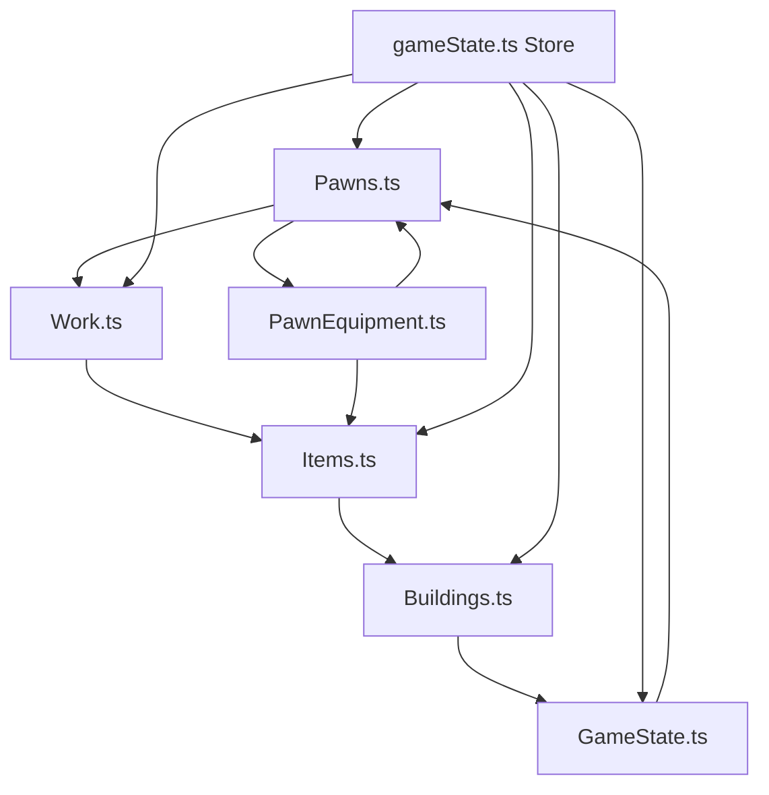

# Fantasia4x Data Flow Analysis

## Executive Summary

This document maps the current data flow through all major systems in Fantasia4x, identifies circular dependencies, and catalogs system integration points. The analysis reveals significant architectural issues that prevent clean system integration and scalable feature development.

## 🚨 Critical Findings

### Major Circular Dependencies Identified

1. **Core Circular Chain**: `Pawns.ts` → `Items.ts` → `Work.ts` → `GameState.ts` → `Pawns.ts`
2. **Equipment Circular Chain**: `Pawns.ts` → `PawnEquipment.ts` → `Items.ts` → `Work.ts` → `Pawns.ts`
3. **Store Integration Chain**: `gameState.ts` → All Core Files → `gameState.ts`

### System Integration Chaos

- **No Central Coordinator**: Systems interact directly with each other
- **Scattered Business Logic**: Functions mixed with data in monolithic files
- **Inconsistent State Management**: Multiple patterns for updating game state
- **Missing Service Layer**: No unified interfaces for system interactions

## Current Data Flow Mapping

### 1. Primary Game Loop Flow

```
GameState.ts (advanceTurn)
    ↓
├── processResearch()
├── processBuildingQueue()
├── processCraftingQueue()
├── processWorkHarvesting() → Work.ts
├── processPawnTurn() → Pawns.ts
├── syncAllPawnInventories() → PawnEquipment.ts
└── generateItems()
```

### 2. Pawn → Work → Resources → Buildings Flow



### 3. Detailed System Dependencies

#### GameState.ts Dependencies
**Imports:**
- `./types` (Type definitions)
- `./Items` → `getItemInfo()`
- `./Work` → `calculateHarvestAmount()`, `processWorkHarvesting()`

**Functions Called:**
- Items: Resource generation, item lookup
- Work: Harvest calculations, work processing
- Buildings: Building effects calculation
- Pawns: Turn processing (via stores)

#### Pawns.ts Dependencies
**Imports:**
- `./types` (Type definitions)
- `./PawnEquipment` → Equipment management functions

**Functions Called:**
- PawnEquipment: Inventory sync, equipment bonuses
- Items: Item information lookup (indirect via equipment)
- Work: Efficiency calculations (via stores)

#### Items.ts Dependencies
**Imports:**
- `./types` (Type definitions only)

**Called By:**
- GameState: Item information lookup
- Work: Resource availability checks
- PawnEquipment: Equipment data
- Buildings: Construction costs
- All UI components: Item display

#### Work.ts Dependencies
**Imports:**
- `./types`, `./Items`, `./Locations`
- `$lib/stores/gameState` → Pawn abilities

**Functions Called:**
- Items: Resource type checking
- Locations: Resource extraction
- Stores: Pawn ability lookup

#### Buildings.ts Dependencies
**Imports:**
- `./types` (Type definitions only)

**Called By:**
- GameState: Building effects, construction
- UI Components: Building information
- Work: Building requirements

### 4. Store Integration Patterns

#### gameState.ts Store Dependencies
**Direct Imports:**
- `Pawns.ts` → `generatePawns()`, `processPawnTurn()`
- `Race.ts` → `generateRace()`
- `Items.ts` → `getBasicMaterials()`, `getItemInfo()`
- `Locations.ts` → Location management functions
- `Buildings.ts` → Building management functions
- `Work.ts` → `calculateHarvestAmount()`, `processWorkHarvesting()`
- `PawnEquipment.ts` → Inventory sync functions
- `Events.ts` → Event system

**State Update Patterns:**
1. **Direct State Mutation**: `state.turn += 1`
2. **Immutable Updates**: `{ ...state, item: newItems }`
3. **Array Updates**: `state.item.map(...)`, `[...state.item]`
4. **Nested Object Updates**: `{ ...state.buildingCounts }`

## System Integration Points Catalog

### 1. Resource Management Integration
- **Items.ts** ↔ **Work.ts**: Resource type validation
- **Items.ts** ↔ **GameState.ts**: Resource generation and consumption
- **Items.ts** ↔ **Buildings.ts**: Construction cost validation
- **Items.ts** ↔ **PawnEquipment.ts**: Equipment data lookup

### 2. Pawn System Integration
- **Pawns.ts** ↔ **PawnEquipment.ts**: Equipment management
- **Pawns.ts** ↔ **Work.ts**: Work efficiency calculations
- **Pawns.ts** ↔ **GameState.ts**: Turn processing and state updates
- **Pawns.ts** ↔ **Stores**: Ability calculations and caching

### 3. Work System Integration
- **Work.ts** ↔ **Items.ts**: Resource availability and type checking
- **Work.ts** ↔ **Locations.ts**: Resource extraction from locations
- **Work.ts** ↔ **Pawns.ts**: Efficiency calculations (via stores)
- **Work.ts** ↔ **GameState.ts**: Work processing and resource updates

### 4. Building System Integration
- **Buildings.ts** ↔ **Items.ts**: Construction cost validation
- **Buildings.ts** ↔ **GameState.ts**: Building effects and population
- **Buildings.ts** ↔ **Research.ts**: Research requirements (implicit)

### 5. State Management Integration
- **gameState.ts** ↔ **All Core Files**: Central state coordination
- **uiState.ts** ↔ **UI Components**: Screen and notification management
- **eventStore.ts** ↔ **Events.ts**: Event generation and display

## Problematic Patterns Identified

### 1. Circular Import Chains

#### Primary Chain: Pawns → Items → Work → GameState → Pawns
```typescript
// Pawns.ts imports PawnEquipment
import { createPawnInventory, getEquipmentBonuses } from './PawnEquipment';

// PawnEquipment.ts imports Items
import { getItemInfo } from './Items';

// Work.ts imports Items and uses GameState store
import { getItemInfo } from './Items';
import { pawnAbilities } from '$lib/stores/gameState';

// GameState.ts imports Work and Items
import { getItemInfo } from './Items';
import { calculateHarvestAmount, processWorkHarvesting } from './Work';

// Store imports Pawns
import { generatePawns, processPawnTurn } from '$lib/game/core/Pawns';
```

### 2. Mixed Concerns in Files

#### Items.ts (2162 lines)
- **Data**: Item definitions and properties
- **Business Logic**: Crafting validation, item queries
- **Integration**: Called by all other systems

#### Buildings.ts (1327+ lines)
- **Data**: Building definitions and properties
- **Business Logic**: Construction validation, building effects
- **Integration**: Building management functions

### 3. Inconsistent State Management

#### Multiple Update Patterns
```typescript
// Pattern 1: Direct mutation
state.turn += 1;

// Pattern 2: Immutable spread
{ ...state, item: newItems }

// Pattern 3: Array mapping
state.item.map(item => ({ ...item, amount: item.amount + production }))

// Pattern 4: Store updates
updateWithSave(state => ({ ...state, ... }))
```

### 4. Scattered Business Logic

#### Work Efficiency Calculations
- **Pawns.ts**: `calculatePawnAbilities()` - Base ability calculations
- **Work.ts**: `calculateWorkEfficiency()` - Work-specific efficiency
- **gameState.ts**: Ability caching and lookup
- **PawnEquipment.ts**: Equipment bonus calculations

#### Resource Management
- **Items.ts**: Item definitions and properties
- **GameState.ts**: Resource generation and consumption
- **Work.ts**: Resource extraction and validation
- **Locations.ts**: Resource node management

## Impact on Development

### 1. Feature Development Blockers
- **Combat System**: Cannot integrate cleanly due to circular dependencies
- **New Buildings**: Requires editing monolithic files
- **Equipment Effects**: Scattered across multiple systems
- **AI Behaviors**: No central coordination point

### 2. Testing Challenges
- **Unit Testing**: Cannot isolate systems due to circular imports
- **Integration Testing**: Complex dependency chains
- **Mocking**: Difficult to mock dependencies
- **Debugging**: Hard to trace data flow

### 3. Performance Issues
- **Bundle Size**: Large monolithic files
- **Hot Reload**: Slow due to circular dependencies
- **Memory Usage**: Unnecessary imports and caching
- **TypeScript Compilation**: Slow due to circular references

## Recommended Architecture Changes

### 1. Service Layer Implementation
```typescript
// ItemService.ts - Clean queries and business logic
export class ItemService {
  static getItemById(id: string): Item | undefined
  static getItemsByType(type: ItemType): Item[]
  static canCraftItem(itemId: string, pawnId: string): boolean
}

// BuildingService.ts - Building validation and effects
export class BuildingService {
  static canBuildBuilding(buildingId: string, gameState: GameState): boolean
  static calculateBuildingEffects(buildingId: string): BuildingEffects
}
```

### 2. GameEngine Central Coordinator
```typescript
// GameEngine.ts - Central system coordinator
export class GameEngine {
  processGameTurn(): void
  coordinateSystemInteractions(): void
  calculatePawnEfficiency(pawnId: string, workType: string): number
  integrateServices(services: ServiceRegistry): void
}
```

### 3. Clean Dependency Flow
```
UI Components
    ↓
GameEngine (Coordinator)
    ↓
Service Layer (Business Logic)
    ↓
Data Layer (Pure Data)
```

## Next Steps

1. **Extract ItemService** from Items.ts monolithic file
2. **Extract BuildingService** from Buildings.ts monolithic file
3. **Create WorkService** for work assignment logic
4. **Implement GameEngine** as central coordinator
5. **Eliminate circular imports** through service layer
6. **Standardize state management** patterns
7. **Update components** to use service layer

## Conclusion

The current architecture suffers from fundamental design issues that prevent scalable development. The circular dependencies, scattered business logic, and missing central coordination create a maintenance nightmare that blocks feature development. The proposed service layer and GameEngine architecture will resolve these issues and enable clean system integration.