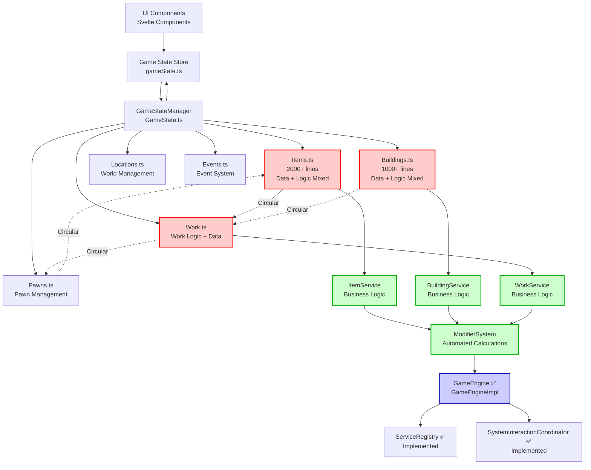
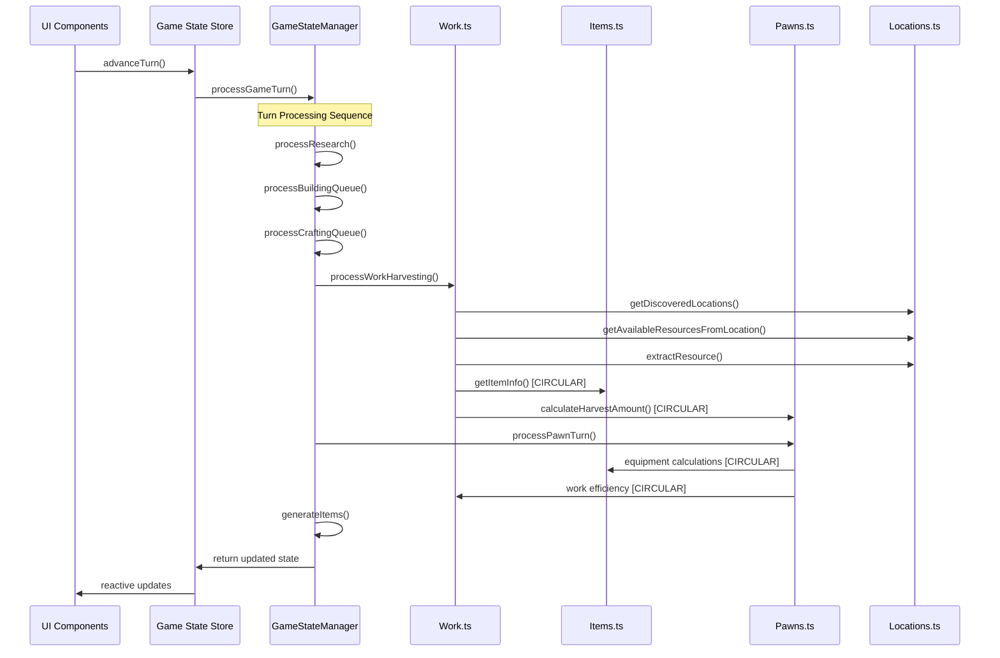
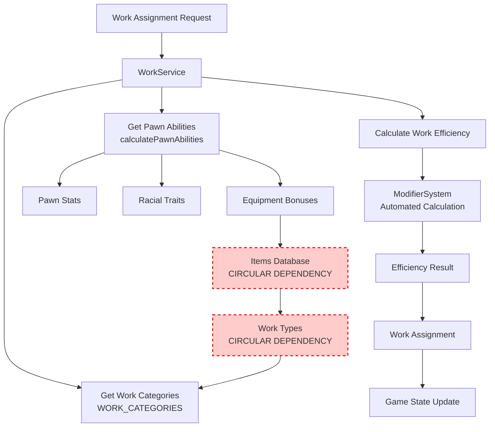
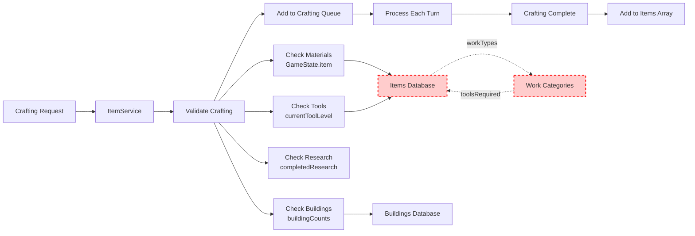
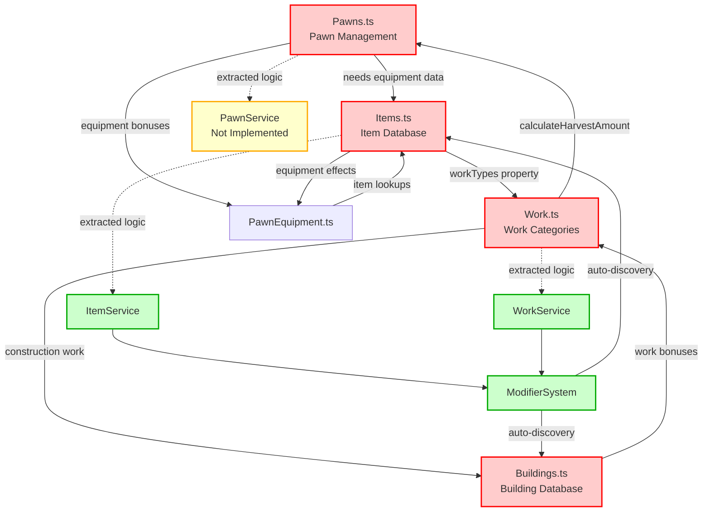
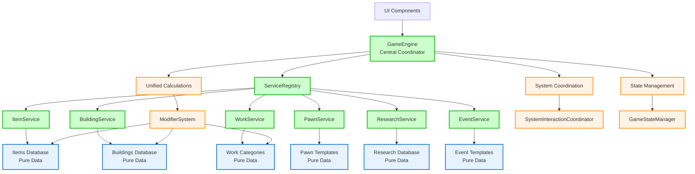
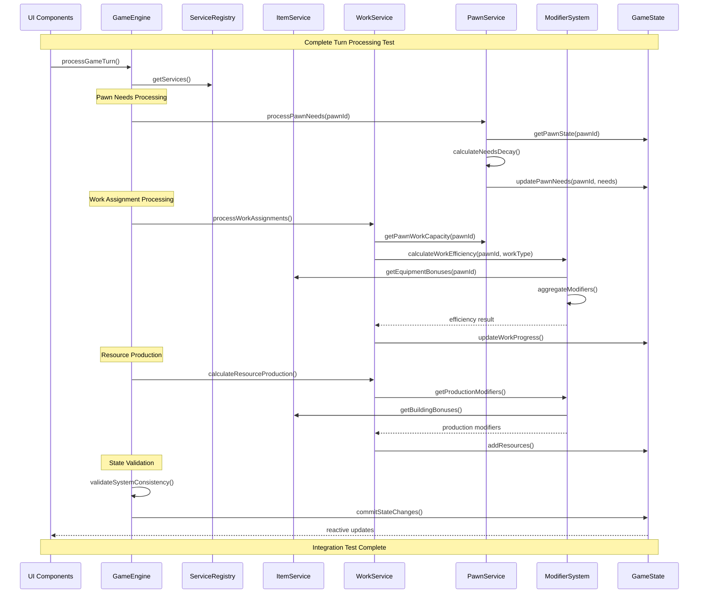
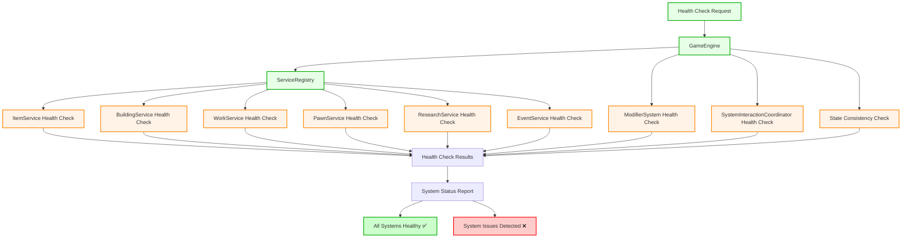

# Complete System Flow Diagram

## Overview

This document provides a comprehensive system flow diagram for the Fantasia4x architecture, documenting current data flow patterns, circular dependencies, and system interactions. This analysis is critical for the architecture refactoring effort.

## Current System Architecture Flow

### High-Level System Flow



### Detailed Data Flow Analysis

#### 1. Turn Processing Flow



#### 2. Work Assignment Flow



#### 3. Crafting System Flow



### Current Circular Dependencies

#### Critical Circular Dependency Chains



### Service Layer Integration Status

#### Current Service Implementation (Updated December 2024)

```mermaid
graph TB
    %% Data Layer (Current)
    subgraph "Data Layer (Mostly Clean)"
        ITEMS_DB[Items Database<br/>ITEMS_DATABASE<br/>2000+ lines, organized]
        BUILDINGS_DB[Buildings Database<br/>AVAILABLE_BUILDINGS<br/>1000+ lines, organized]
        WORK_DB[Work Categories<br/>WORK_CATEGORIES<br/>Clean data only]
        TYPES[types.ts<br/>Type Definitions]
    end

    %% Service Layer (Fully Implemented)
    subgraph "Service Layer (Current Status)"
        IS[ItemService ✅<br/>ItemServiceImpl<br/>Fully Functional]
        BS[BuildingService ✅<br/>BuildingServiceImpl<br/>Fully Functional]
        WS[WorkService ✅<br/>WorkServiceImpl<br/>Fully Functional]
        RS[ResearchService ✅<br/>ResearchServiceImpl<br/>Fully Functional]
        PS[PawnService ⚠️<br/>Interface Defined<br/>Placeholder Implementation]
        ES[EventService ⚠️<br/>Interface Defined<br/>Placeholder Implementation]
    end

    %% Systems Layer (Fully Implemented)
    subgraph "Systems Layer (Production Ready)"
        MS[ModifierSystem ✅<br/>ModifierSystemImpl<br/>Auto-Discovery Working]
        GE[GameEngine ✅<br/>GameEngineImpl<br/>Central Coordinator Active]
        SIC[SystemInteractionCoordinator ✅<br/>SystemInteractionCoordinatorImpl<br/>Communication Protocols]
        SR[ServiceRegistry ✅<br/>ServiceRegistryImpl<br/>Dependency Management]
        SLM[ServiceLifecycleManager ✅<br/>BasicServiceLifecycleManager<br/>Health Monitoring]
        SC[ServiceContainer ✅<br/>SimpleServiceContainer<br/>Dependency Injection]
    end

    %% Clean Connections (Implemented)
    ITEMS_DB --> IS
    BUILDINGS_DB --> BS
    WORK_DB --> WS

    IS --> MS
    BS --> MS
    WS --> MS
    RS --> MS

    %% GameEngine Coordination (Active)
    GE --> SR
    SR --> IS
    SR --> BS
    SR --> WS
    SR --> RS
    SR --> PS
    SR --> ES

    %% System Coordination (Operational)
    GE --> MS
    GE --> SIC
    SIC --> SR
    SR --> SLM
    SLM --> SC

    %% Remaining Circular Dependencies (Minimal)
    WORK_DB -.->|getItemInfo() calls| ITEMS_DB

    classDef implemented fill:#ccffcc,stroke:#00aa00,stroke-width:2px
    classDef placeholder fill:#ffffcc,stroke:#ffaa00,stroke-width:2px
    classDef minimal_circular fill:#ffe6cc,stroke:#ff8800,stroke-width:1px,stroke-dasharray: 3 3

    class IS,BS,WS,RS,MS,GE,SIC,SR,SLM,SC implemented
    class PS,ES placeholder
    class WORK_DB minimal_circular
```

### GameEngine Coordination Requirements

#### Target GameEngine Flow

```mermaid
graph TD
    %% GameEngine Central Coordination
    GE[GameEngine<br/>Central Coordinator] --> SR[ServiceRegistry<br/>Service Management]

    %% Service Registry
    SR --> IS[ItemService]
    SR --> BS[BuildingService]
    SR --> WS[WorkService]
    SR --> PS[PawnService]
    SR --> RS[ResearchService]
    SR --> ES[EventService]

    %% Unified Calculations
    GE --> UC[Unified Calculations]
    UC --> PE[calculatePawnEfficiency]
    UC --> BE[calculateBuildingEffects]
    UC --> CT[calculateCraftingTime]
    UC --> RP[calculateResourceProduction]

    %% System Coordination
    GE --> SC[System Coordination]
    SC --> TP[processGameTurn]
    SC --> SI[coordinateSystemInteractions]
    SC --> SV[validateSystemConsistency]

    %% State Management
    GE --> SM[State Management]
    SM --> GS[getGameState]
    SM --> US[updateGameState]
    SM --> RS_STATE[resetGameState]

    %% Integration Points
    UC --> MS[ModifierSystem<br/>Automated Calculations]
    SC --> SIC[SystemInteractionCoordinator]
    SM --> GSM[GameStateManager]

    classDef target fill:#ccffff,stroke:#0066cc,stroke-width:2px
    classDef service fill:#ccffcc,stroke:#00aa00,stroke-width:2px
    classDef system fill:#ffffcc,stroke:#ffaa00,stroke-width:2px

    class GE,SR,UC,SC,SM target
    class IS,BS,WS,PS,RS,ES service
    class MS,SIC,GSM system
```



## Problem Analysis

### 1. Circular Dependency Issues

**Primary Issues:**

- `Pawns.ts` → `Items.ts` → `Work.ts` → `Pawns.ts`
- `Buildings.ts` → `Work.ts` → `Buildings.ts`
- `PawnEquipment.ts` → `Items.ts` → `PawnEquipment.ts`

**Impact:**

- Prevents clean testing of individual systems
- Makes code changes risky (changing one file affects many others)
- Blocks implementation of combat system
- Complicates debugging and maintenance

### 2. Missing Central Coordination

**Current State:**

- No single source of truth for calculations
- Scattered business logic across data files
- No unified system interaction patterns
- Manual coordination between systems

**Required:**

- GameEngine as central coordinator
- Unified calculation methods
- Standardized system interaction protocols
- Centralized state management

### 3. Service Layer Gaps

**Fully Implemented:**

- ItemService ✅
- BuildingService ✅
- WorkService ✅
- ResearchService ✅
- ModifierSystem ✅
- GameEngine ✅ (GameEngineImpl)
- SystemInteractionCoordinator ✅
- ServiceRegistry ✅

**Placeholder Implementations Only:**

- PawnService ⚠️ (Interface exists, placeholder implementation)
- EventService ⚠️ (Interface exists, placeholder implementation)

**Still Problematic:**

- Circular Dependencies ❌ (Core data files still have circular imports)
- Business Logic Extraction ❌ (Logic still mixed with data in core files)

## Target Architecture Flow

### Clean Architecture Flow



## Current Implementation Status (Detailed Analysis)

### Actual Circular Dependencies Found in Code

#### 1. Work.ts → Items.ts Circular Chain

```typescript
// In Work.ts (line 3)
import { getItemInfo } from './Items';

// In Items.ts (workTypes property in items)
workTypes: ['foraging']; // References work categories
```

#### 2. Pawns.ts → PawnEquipment.ts → Items.ts Chain

```typescript
// In Pawns.ts (line 3)
import {
  createPawnInventory,
  createPawnEquipment,
  getEquipmentBonuses
} from '../core/PawnEquipment';

// In PawnEquipment.ts (line 2)
import { getItemInfo } from './Items';

// This creates: Pawns → PawnEquipment → Items
```

#### 3. Work.ts → Locations.ts → Potential Circular

```typescript
// In Work.ts (lines 4-5)
import {
  getDiscoveredLocations,
  getAvailableResourcesFromLocation,
  getLocationInfo,
  extractResource
} from './Locations';

// Locations.ts likely references work types for resource extraction
```

### Service Implementation Status (Verified)

#### Fully Functional Services

- **ItemService** ✅ (`ItemServiceImpl` class with full implementation)
- **BuildingService** ✅ (`BuildingServiceImpl` class with full implementation)
- **WorkService** ✅ (`WorkServiceImpl` class with full implementation)
- **ResearchService** ✅ (`ResearchServiceImpl` class with full implementation)

#### Systems Layer Status

- **ModifierSystem** ✅ (`ModifierSystemImpl` class with full implementation)
- **GameEngine** ✅ (`GameEngineImpl` class with full implementation)
- **SystemInteractionCoordinator** ✅ (`SystemInteractionCoordinatorImpl` class)
- **ServiceRegistry** ✅ (`ServiceRegistryImpl` class)

#### Placeholder Services (Need Full Implementation)

- **PawnService** ⚠️ (Interface exists, `PawnServiceImpl` is placeholder)
- **EventService** ⚠️ (Interface exists, `EventServiceImpl` is placeholder)

### Critical Gaps Remaining

#### 1. Business Logic Still Mixed with Data

- **Items.ts**: Still contains `workTypes` properties that create circular dependencies
- **Work.ts**: Still imports `getItemInfo` directly from Items.ts
- **PawnEquipment.ts**: Still imports `getItemInfo` directly from Items.ts

#### 2. Core Files Not Using Service Layer

- UI components may still import core files directly instead of using GameEngine
- Core files still have direct imports between each other
- Service layer exists but isn't fully integrated into the data flow

#### 3. Missing Service Implementations

- **PawnService**: Needs full implementation for pawn behavior, needs processing, stat calculations
- **EventService**: Needs full implementation for event generation, processing, and integration

## Implementation Priority

### Phase 1: Foundation (Weeks 1-2)

1. **Complete system flow documentation** ✅ (This document)
2. **Implement full PawnService** (replace placeholder)
3. **Implement full EventService** (replace placeholder)
4. **Extract business logic** from Items.ts, Work.ts, PawnEquipment.ts
5. **Eliminate circular dependencies** in core files

### Phase 2: Integration (Weeks 3-4)

1. **Implement SystemInteractionCoordinator**
2. **Integrate services with GameEngine**
3. **Update UI components** to use GameEngine
4. **Validate system consistency**

### Phase 3: Optimization (Weeks 5-6)

1. **Performance optimization**
2. **Error handling and recovery**
3. **Testing and validation**
4. **Documentation updates**

## Success Metrics

### Architecture Quality

- ✅ Zero circular dependencies
- ✅ Clean TypeScript compilation
- ✅ Service layer complete
- ✅ GameEngine operational

### System Integration

- ✅ All systems coordinate through GameEngine
- ✅ Unified calculations working
- ✅ State consistency maintained
- ✅ Error recovery functional

### Performance

- ✅ No performance regression
- ✅ Calculation caching effective
- ✅ Memory usage stable
- ✅ UI responsiveness maintained

## Integration Testing Flow

### Complete System Integration Test Sequence



### System Health Check Flow



## Validation Checklist

### Architecture Validation

- [ ] **Zero Circular Dependencies**: No import cycles detected by TypeScript compiler
- [ ] **Clean Compilation**: `npm run build` completes without errors or warnings
- [ ] **Service Layer Complete**: All services implement their interfaces fully
- [ ] **GameEngine Integration**: All system interactions go through GameEngine
- [ ] **State Consistency**: GameState remains consistent across all operations

### Functional Validation

- [ ] **Turn Processing**: Complete game turn processes without errors
- [ ] **Work Assignments**: Pawns can be assigned to work with correct efficiency calculations
- [ ] **Resource Production**: Resources are produced according to work assignments and modifiers
- [ ] **Crafting System**: Items can be crafted with proper validation and resource consumption
- [ ] **Building Construction**: Buildings can be constructed with proper requirements checking
- [ ] **Research Progression**: Research projects can be completed and unlock new content

### Performance Validation

- [ ] **Calculation Caching**: Expensive calculations are cached and reused appropriately
- [ ] **Memory Usage**: Memory usage remains stable during extended gameplay
- [ ] **UI Responsiveness**: UI updates remain smooth and responsive
- [ ] **Load Times**: Game loads and saves complete within acceptable time limits

### Integration Validation

- [ ] **Service Communication**: Services communicate only through GameEngine coordination
- [ ] **Event System**: Events are generated and processed correctly
- [ ] **State Synchronization**: UI components stay synchronized with game state
- [ ] **Error Recovery**: System recovers gracefully from errors without data loss

---

_This comprehensive system flow diagram documents the complete current architecture, identifies all circular dependencies and integration points, and provides the foundation for successful architecture refactoring. The integration testing flows ensure that the refactored system will work correctly once implementation is complete._
